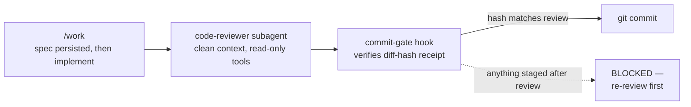
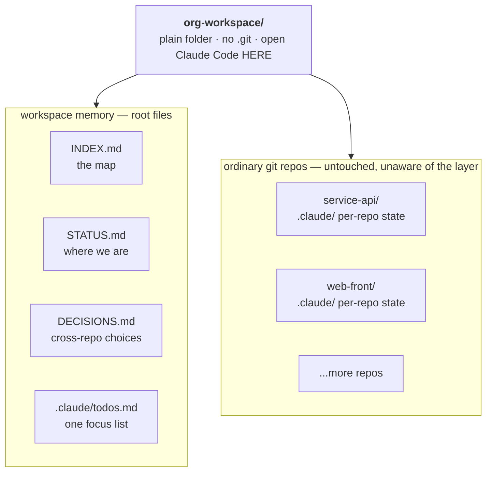

<div align="center">

# claude-workspace

**A senior workflow for Claude Code, encoded as 16 skills, 4 hooks, and one habit: open the session one level above the repos.**

[](./LICENSE)
[](./.claude-plugin/plugin.json)
[](./docs/FRAMEWORK.md#the-sixteen-skills)
[](./CONTRIBUTING.md)

</div>

Each skill works two ways: invoke it manually (`/work`, `/conventions`, ...) like the slash commands they evolved from, or let Claude **auto-activate** it — Claude reads each skill's description and applies the matching one when your request calls for it, without being asked. The methodology applies itself even when you forget it exists.

## Why it's different

Three things distinguish it from prompt-pack frameworks:

**1. Gates are mechanisms, not prose.** "Never commit unreviewed code" is a `PreToolUse` hook that hashes the staged diff and physically blocks `git commit` — not an instruction the model can miss. Specs persist to files (`.claude/specs/`), so review checks run against artifacts, not against memory.



**2. It works one level above the repos.** A plain workspace folder holding multiple git repos gets its own map, one cross-repo focus list, and session-start status push — the shape real work actually has. See [The workspace layer](#the-workspace-layer).

**3. Separation of powers.** The author, the reviewer, and the gate are different actors: the main session implements, a subagent with **no write tools** reviews with a clean context, and a hook — code, not prompts — decides whether the commit happens.

## Install

> [!IMPORTANT]
> Pick **one** option. Installing both gives you every skill twice (`/work` and `/claude-workspace:work`).

<details open>
<summary><b>Option A — Plugin</b> (recommended: skills + subagent + all 4 hooks, one managed unit)</summary>

<br/>

Inside any Claude Code session:

```
/plugin marketplace add mauroepce/claude-workspace
/plugin install claude-workspace@mauroepce
```

This repo is its own [plugin marketplace](./.claude-plugin/marketplace.json). You get versioned installs, one-command updates (`/plugin marketplace update mauroepce`), and clean uninstall from `/plugin`.

Trade-offs vs the curl installer:
- Plugin skills are namespaced: `/claude-workspace:work` instead of `/work` (auto-invocation by description works identically either way).
- Code templates are NOT part of the plugin — copy `templates/` manually or use the curl installer's template step.

</details>

<details>
<summary><b>Option B — Curl installer</b> (bare <code>/name</code> commands + the 9 code templates)</summary>

<br/>

```bash
curl -fsSL https://raw.githubusercontent.com/mauroepce/claude-workspace/main/bin/install-personal.sh | bash
```

Installs:
- 16 skills to `~/.claude/skills/<name>/SKILL.md` (invoked as bare `/work`, `/conventions`, ...)
- 9 code templates + 1 CI workflow template to `~/.claude/templates/`
- The `code-reviewer` subagent to `~/.claude/agents/`

Idempotent — re-run anytime to update. Backs up your modified files to `*.bak` before replacing. Legacy slash-command files from pre-skills versions are cleaned up automatically.

Then add the two command hooks (requires `jq`):

```bash
bash <(curl -fsSL https://raw.githubusercontent.com/mauroepce/claude-workspace/main/bin/install-hooks.sh)
```

- **Commit gate** (`PreToolUse`) — physically blocks `git commit` unless `/code-review` reviewed the exact staged diff. Details in [`docs/FRAMEWORK.md`](./docs/FRAMEWORK.md#deterministic-gates-the-commit-hook).
- **Session status** (`SessionStart`) — pushes the focused `/todo` task into context the moment the session opens.

Note: the two lifecycle prompt hooks (post-edit self-check, session-close check) ship only with the plugin.

</details>

## The workspace layer

The toolkit's most distinctive habit: open Claude Code **one level above the repos**, in a plain folder that is not a git repo itself.



`/onboard` detects this shape automatically (no root `.git`, 2+ child git repos) and builds the `INDEX.md`; `/todo` keeps one focus list across repos; the session-start hook pushes the focused task into context the moment you open the session. The child repos stay untouched — no submodules, no workspace build, nothing to explain to your team. The layer exists for memory, not for tooling: it's what makes "where was I with this client?" a question the session answers instead of asks.

Works for an organization's repo fleet, a service + front product pair, or any multi-item pipeline you steer with an agent. Full write-up in [`docs/FRAMEWORK.md`](./docs/FRAMEWORK.md#the-workspace-layer-state-one-level-above-the-repos).

## The five principles

1. **Spec before generation** — every task starts with a structured spec, not "hey claude write me X"
2. **Critical review of agent output** — never accept a first response, treat output like a junior's PR
3. **Persistent context** — conventions, architecture, decisions, todos all live in version-controlled files, not in chat history
4. **Workflow as artifact** — when a prompt repeats 3 times, it becomes a skill
5. **Atomic commands compose** — small commands you can invoke standalone, or chain into orchestrators like `/safe-commit`

## Quick reference

| Command | What it does |
|---|---|
| `/work` | Spec-first task framework: spec (persisted) → context → plan → implement → review |
| `/quick-work` | Lite version of `/work` for small tasks (single-file edits, fixes) |
| `/todo` | Persistent task tracking with milestones, survives across sessions; in-prose markers (`TODO:`/`blocker:`/`done:`); workspace-aware |
| `/issue <N>` | Pull a GitHub issue, structure its context, hand off to `/work` |
| `/debug` | Hypothesis-driven debugging: root cause over symptom; archives lessons to `docs/mistakes/` |
| `/conventions` | Scan codebase for style patterns, persist to `.claude/conventions.md` |
| `/architecture` | Scan codebase structure, persist to `.claude/architecture-map.md` |
| `/journeys` | Detect user flows, produce Mermaid sequence diagrams |
| `/decision` | Capture a technical decision with alternatives + confidence level |
| `/code-review` | Quality review of staged changes (atomic, reusable) |
| `/safe-commit` | `/code-review` + `/security-review` + spec check + commit with confirmation |
| `/safe-push` | Full-branch review + push (refuses main without OK) |
| `/scaffold` | Pick from curated code templates, insert adapted to context |
| `/onboard` | Joining a new codebase; workspace folders get a root `INDEX.md`, team repos get `*.local.md` artifacts |
| `/isolate` | Clean workspace for tests/interviews — prevents context bleed from other projects |
| `/commands` | List all installed personal skills with their descriptions |

Full methodology and per-skill details in [`docs/FRAMEWORK.md`](./docs/FRAMEWORK.md).

## How layering works

Personal skills live in `~/.claude/skills/`. They're available in **any project you open with Claude Code** — your own repos, client repos, team repos where you don't control configuration.

If a project has its own `.claude/skills/` (or `.claude/commands/`) with a same-named entry, **the project version wins**. Your personal skills fill the gaps without overriding team conventions. Nothing gets committed to a team's repo just because you use this toolkit.

<details>
<summary><b>Templates</b> — 9 working code files with the conventions baked in</summary>

<br/>

The `~/.claude/templates/` library contains working code files with my conventions baked in (TypeScript strict, Zod validation at boundaries, error class hierarchies, async retry with jitter, Result types, etc.).

Use them via `/scaffold` or read directly:

```bash
ls ~/.claude/templates/
cat ~/.claude/templates/backend/nest-controller.ts
```

Templates include teaching comments by default — they explain the WHY of each pattern. Strip them once you've internalized the pattern.

</details>

<details>
<summary><b>Update / Uninstall</b></summary>

<br/>

**Update** — plugin installs: `/plugin marketplace update mauroepce`. Curl installs: re-run the install command; modified files get backed up to `*.bak`.

```bash
curl -fsSL https://raw.githubusercontent.com/mauroepce/claude-workspace/main/bin/install-personal.sh | bash
```

**Uninstall** — plugin installs: from `/plugin`. Curl installs:

```bash
rm -rf ~/.claude/skills/{work,quick-work,todo,issue,debug,conventions,architecture,journeys,decision,code-review,safe-commit,safe-push,scaffold,onboard,isolate,commands}
rm -rf ~/.claude/templates/
```

</details>

## Contributing

Bug reports and small fixes are welcome; feature ideas need an issue before code — the toolkit stays deliberately small. Full policy in [CONTRIBUTING.md](./CONTRIBUTING.md).

Using Claude Code? Clone the repo and tell Claude "I want to contribute X" — the repo's `CLAUDE.md` instructs it to follow the contribution flow for you.

## Why this exists

In 2026 the bottleneck of senior engineering is no longer typing speed — it's **directing the model with judgment**. That requires repeatable workflows, explicit reasoning, persistent context, and atomic tools that compose.

This toolkit is my attempt at that. It's opinionated. It's a personal style, not a universal best practice. But it's been refined through real work — production biotech code, a SaaS factory, portfolio pieces at [mauroepce.dev](https://mauroepce.dev), and daily multi-repo work at my current job.

If you've felt the gap between "I use Cursor" and "I have a workflow," this is what closing that gap can look like.

[MIT](./LICENSE) — use freely. If you find the methodology useful, fork and adapt to your own style.

— [@mauroepce](https://github.com/mauroepce)
